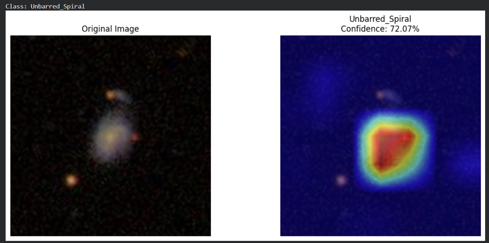
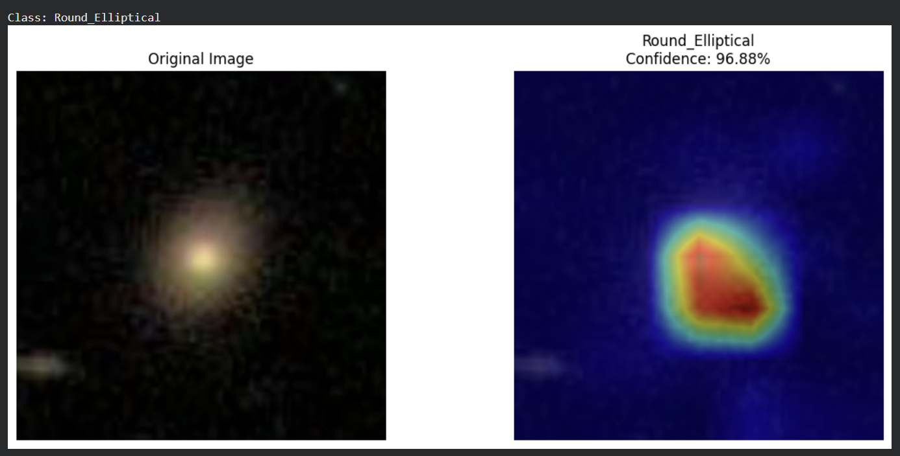
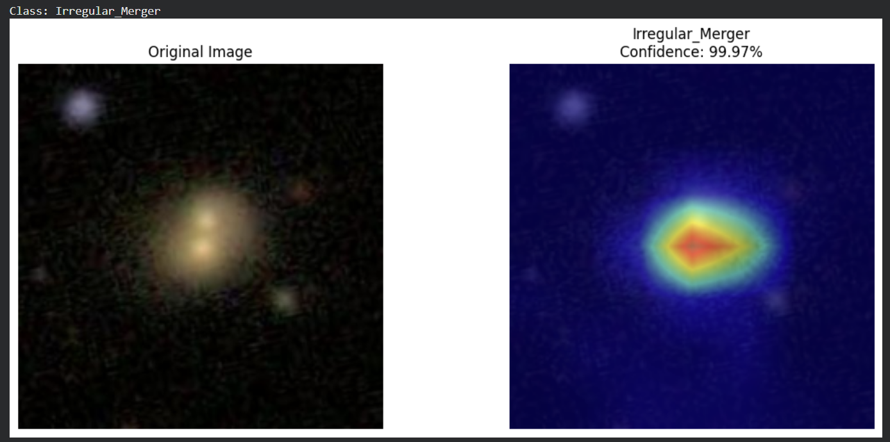

# GalaxyVision AI

<div align="center">

**End-to-end Deep Learning project for Galaxy Morphology Classification using the Galaxy Zoo dataset**


[Live Demo](https://galaxy-vision-ai.streamlit.app/)

</div>

---

## Overview

GalaxyVision AI is a computer vision project that classifies galaxy images into scientifically meaningful morphology categories using deep learning and transfer learning.

The project includes:
- dataset understanding and cleaning
- Galaxy Zoo label engineering
- baseline CNN training
- transfer learning with ResNet50
- Grad-CAM explainability
- Streamlit deployment

The goal is not only to predict galaxy morphology, but also to make the model interpretable and demo-friendly.

---

## Project Goal

Build a galaxy image classification system that can identify morphology classes such as:

- Round Elliptical
- Intermediate Elliptical
- Edge-On Disk
- Barred Spiral
- Unbarred Spiral
- Irregular / Merger

This project follows a complete ML workflow:

1. Dataset understanding  
2. Label engineering  
3. Data cleaning  
4. Model training  
5. Explainability with Grad-CAM  
6. Web deployment with Streamlit  

---

## Dataset

**Dataset used:** Galaxy Zoo

Galaxy Zoo provides galaxy images along with volunteer vote distributions for morphology-related questions.

Instead of using raw labels directly, morphology labels were engineered from the Galaxy Zoo decision hierarchy and filtered using a confidence threshold to improve label quality.

---

## Morphology Classes

| Class | Description |
|------|-------------|
| `Round_Elliptical` | Smooth and round galaxy |
| `Intermediate_Elliptical` | Smooth but elongated galaxy |
| `EdgeOn_Disk` | Disk galaxy viewed from the side |
| `Barred_Spiral` | Spiral galaxy with a central bar |
| `Unbarred_Spiral` | Spiral galaxy without a central bar |
| `Irregular_Merger` | Disturbed or merging galaxy |

---

## Label Engineering

Galaxy Zoo provides probabilities rather than explicit labels.

Morphology scores were computed from the hierarchical decision tree. The final class label was assigned based on the highest score.

Example:

```python
Round_Elliptical = Class1.1 * Class7.1

Barred_Spiral = Class1.2 * Class4.1 * Class3.1
```

To improve label reliability, only high-confidence samples were retained.

---

## Dataset Cleaning

### Confidence-based filtering

Each galaxy receives a morphology confidence score:

```python
Confidence = max(morphology_scores)
```

Only samples with:

```python
Confidence >= 0.4
```

were kept for training.

This reduced ambiguity and improved class consistency.

---

## Dataset Statistics

| Metric | Value |
|--------|------:|
| Original samples | 61,578 |
| Clean samples | 26,281 |
| Number of classes | 6 |
| Framework | PyTorch |
| Hardware | Tesla T4 GPU |

### Class distribution
- Round Elliptical
- Intermediate Elliptical
- Edge-On Disk
- Unbarred Spiral
- Barred Spiral
- Irregular / Merger

---

## Model Development

### Baseline CNN
A custom CNN was trained as a baseline to establish initial performance.

### Transfer Learning
A pretrained **ResNet50** model was fine-tuned on the cleaned galaxy dataset, significantly improving classification performance.

### Evaluation
The model was evaluated using:
- Accuracy
- Weighted F1 Score
- Macro F1 Score
- Confusion Matrix

---

## Model Comparison

| Model | Description | Validation Accuracy | Weighted F1 | Macro F1 | Notes |
|------|-------------|------:|------:|------:|------|
| Custom CNN | Lightweight baseline model trained from scratch | 73.4% | 71.3% | 62.1% | Good baseline, struggled on minority classes |
| ResNet50 | Transfer learning with pretrained CNN backbone | 86.45% | 84.9% | 82.25% | Best overall performance, improved class separation |

---

## Results

| Metric | Value |
|--------|------:|
| Baseline Validation Accuracy | 73.4% |
| ResNet50 Validation Accuracy | 86.45% |
| ResNet50 Macro F1 Score | 0.8225 |
| Baseline Weighted F1 Score | 71.3% |

The transfer learning model improved performance significantly, especially on well-defined morphology classes.

---

## Confusion Matrix Insights

The main confusion pairs were:

- Barred Spiral ↔ Unbarred Spiral
- Round Elliptical ↔ Intermediate Elliptical
- Unbarred Spiral ↔ Irregular Merger

These errors are scientifically reasonable because these classes share similar visual features.

The model performed especially well on:
- Edge-On Disk
- Round Elliptical

The most difficult class remained:
- Irregular / Merger

---

## Explainability with Grad-CAM

Grad-CAM was implemented to visualize which parts of an image influenced the model’s prediction.

### Key observations
- Spiral galaxies activated around arms and central bulges
- Elliptical galaxies activated across the full galaxy body
- Irregular galaxies activated around asymmetric or distorted regions
- Background noise contributed minimally to predictions

### Grad-CAM preview







---

## Live Demo

Try the deployed app here:

**[Launch Live Demo](https://galaxy-vision-ai.streamlit.app/)**

The Streamlit app allows users to:
- upload a galaxy image
- get a morphology prediction
- view prediction confidence
- inspect Grad-CAM heatmaps

---

## Tech Stack

| Category | Tools |
|---------|-------|
| Language | Python |
| Data Processing | Pandas, NumPy |
| Visualization | Matplotlib, Seaborn |
| Deep Learning | PyTorch, Torchvision |
| Image Processing | OpenCV, Albumentations |
| Explainability | Grad-CAM |
| Deployment | Streamlit |
| Development | Google Colab |
| Version Control | GitHub |

---

## Project Structure

```text
galaxy-vision-ai/
│
├── app.py
├── requirements.txt
├── README.md
├── .gitignore
│
├── models/
│   └── resnet50.pth
│
├── data/
│   └── processed/
│
└── notebooks/
    ├── 01_EDA_Cleaning.ipynb
    ├── 02_CNN_Baseline.ipynb
    ├── 03_ResNet50_Training.ipynb
    └── 04_GradCAM_Error_Analysis.ipynb


```

---

## Future Enhancements

- Hierarchical classification
- Redshift estimation
- Galaxy similarity search
- Anomaly detection
- Galaxy-to-Pokémon mapping

---

## What I Learned

- How to engineer labels from a hierarchical dataset
- How to clean noisy real-world scientific data
- How to train CNNs and transfer learning models
- How to interpret predictions with Grad-CAM
- How to deploy an ML model using Streamlit

---

## Acknowledgements

- Galaxy Zoo dataset
- PyTorch
- Torchvision
- Streamlit
- Grad-CAM research

---

## License

Add your preferred license here.
